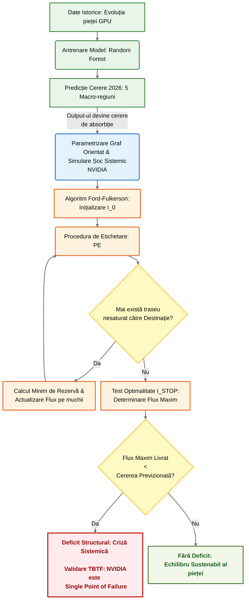

```mermaid
%%{init: {"flowchart": {"nodeSpacing": 15, "rankSpacing": 25}}}%%
graph TD
    %% Definirea stilurilor cu text negru fortat pentru vizibilitate maxima pe GitHub
    classDef ML fill:#e8f5e9,stroke:#2e7d32,stroke-width:2px,color:#000000;
    classDef Retea fill:#e3f2fd,stroke:#1565c0,stroke-width:2px,color:#000000;
    classDef Algoritm fill:#fff3e0,stroke:#e65100,stroke-width:2px,color:#000000;
    classDef Decizie fill:#fff9c4,stroke:#fbc02d,stroke-width:2px,color:#000000;
    classDef Criza fill:#ffebee,stroke:#c62828,stroke-width:3px,color:#900000,font-weight:bold;
    classDef Echilibru fill:#f1f8e9,stroke:#33691e,stroke-width:2px,color:#1b5e20,font-weight:bold;

    %% Fortam textul de pe sageti sa fie si el negru si vizibil
    linkStyle default color:#000000, stroke:#777777, stroke-width:2px;

    %% Faza 1: Machine Learning
    A[Date Istorice: Evoluția pieței GPU]:::ML --> B(Antrenare Model: Random Forest):::ML
    B --> C[Predicție Cerere 2026: 5 Macro-regiuni]:::ML

    %% Faza 2: Integrarea in retea
    C -- "Output-ul devine cerere \n de absorbție" --> D(Parametrizare Graf Orientat & <br> Simulare Șoc Sistemic NVIDIA):::Retea

    %% Faza 3: Algoritmul Ford-Fulkerson
    D --> E[Algoritm Ford-Fulkerson: <br> Inițializare I_0]:::Algoritm
    E --> F(Procedura de Etichetare: PE):::Algoritm
    F --> G{Mai există traseu <br> nesaturat către Destinație?}:::Decizie
    
    %% Buclele algoritmului
    G -- Da --> H[Calcul Minim de Rezervă & <br> Actualizare Flux pe muchii]:::Algoritm
    H --> F
    
    %% Iesirea din algoritm
    G -- Nu --> I[Test Optimalitate I_STOP: <br> Determinare Flux Maxim]:::Algoritm

    %% Faza 4: Decizia si Concluzia
    I --> J{Flux Maxim Livrat <br> < <br> Cererea Previzionată?}:::Decizie
    J -- Da --> K[Deficit Structural: Criză Sistemică <br><br> Validare TBTF: NVIDIA este <br> Single Point of Failure]:::Criza
    J -- Nu --> L[Fără Deficit: <br> Echilibru Sustenabil al pieței]:::Echilibru
```
